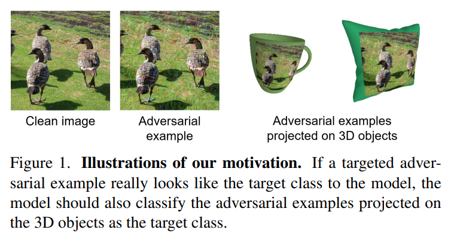
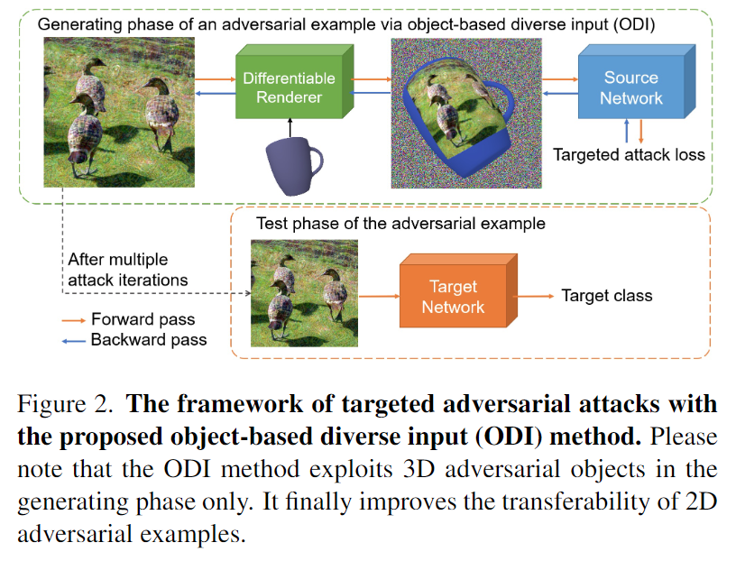
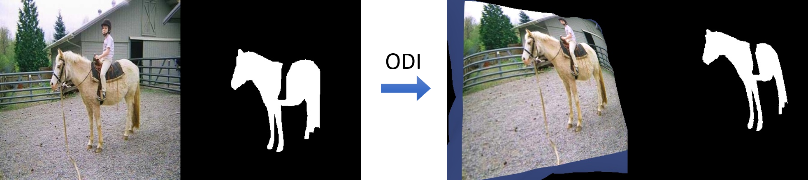

# Object-based Diverse Input (ODI)

####  Official PyTorch implementation of the CVPR 2022 paper:
#### "Improving the Transferability of Targeted Adversarial Examples Through Object-Based Diverse Input"
##### *Junyoung Byun, Seungju Cho, Myung-Joon Kwon, Hee-Seon Kim, and Changick Kim*

[[Paper]](https://openaccess.thecvf.com/content/CVPR2022/papers/Byun_Improving_the_Transferability_of_Targeted_Adversarial_Examples_Through_Object-Based_Diverse_CVPR_2022_paper.pdf) | [[arXiv]](https://arxiv.org/abs/2203.09123) | [[Poster]](https://drive.google.com/file/d/1n0vHhYy0JAcbUshMWCbB_LbpoD03BJxB/view?usp=sharing)

<center>





</center>

##### Object-based Diverse Input (ODI) is a novel data augmentation technique for improving the transferability of targeted adversarial examples.


## Dependencies

Tested in Anaconda3 with Python 3.6, PyTorch 1.9, and PyTorch3D 0.6.0

We have saved the conda environment for Ubuntu.

The conda environment can be installed by entering the following command at the conda prompt.

> conda env create -f odi_env.yaml


## Dataset
Due to upload file size limitations, we cannot include all the test images. Instead, we included 100 test images.

Please download full test images from the following link: [Dataset for nips17 adversarial competition](https://github.com/cleverhans-lab/cleverhans/tree/master/cleverhans_v3.1.0/examples/nips17_adversarial_competition/dataset) and place the images of the DEV set into './dataset/images'.

If you want to use full test images, please comment line 77 of 'eval_attacks.py' (-> # total_img_num=100).

## Evaluation

You can perform a transfer-based targeted attack experiment by entering the following command:

> python eval_attacks.py --config_idx=101

The 'eval_attacks.py' script receives config_idx as an execution argument, which designates the experiment configuration number.

The experiment configuration specifies the various parameters required for the experiment, such as epsilon, step size, various hyperparameters for ODI, etc. They are written in 'config.py,' and their summarized description is written in 'exp_info.xlsx.'

When an experiment is completed, the 'NEW_EXP_config_idx.xlsx' file is created in the results folder.
Using gen_table.py and gen_plot.py, you can print and visualize the attack success rates for comparison.

## ODI as a data augmentation technique
We expect that ODI can be useful in other computer vision tasks such as semantic segmentation and few-shot image classification.

For example, ODI can be utilized in few-shot segmentation as follows.

<center>



</center>

We used rigid body 3D models for the experiments, but one can use deformable 3D models with rigging for more versatile transformations.

Code release TODO:
- [ ] An easy-to-use image transform version of ODI for application in other computer vision tasks
- [ ] An efficient batched processing version of ODI
- [ ] Example code of ODI to transform both an image and its label map (for semantic segmentation)

## Acknowledgment
We thank the authors of [VT](https://github.com/JHL-HUST/VT) and [LogitAttack](https://github.com/ZhengyuZhao/Targeted-Tansfer) for sharing their code. We also thank the producers of the six 3D source objects for sharing their 3D models for free.

## BibTeX
```
@InProceedings{Byun_2022_CVPR,
    author    = {Byun, Junyoung and Cho, Seungju and Kwon, Myung-Joon and Kim, Hee-Seon and Kim, Changick},
    title     = {Improving the Transferability of Targeted Adversarial Examples Through Object-Based Diverse Input},
    booktitle = {Proceedings of the IEEE/CVF Conference on Computer Vision and Pattern Recognition (CVPR)},
    month     = {June},
    year      = {2022},
    pages     = {15244-15253}
}
```